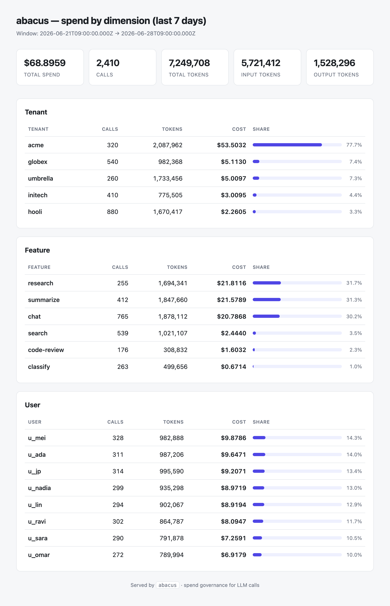

# abacus

A **cost-governance layer for LLM calls.** It meters and attributes every token,
enforces per-tenant budgets, and degrades gracefully when a budget tightens —
instead of silently overspending and finding out on the monthly invoice.

The architectural idea on show is a **policy engine that sits in the model-call
path** and can meter, attribute, cap, and downshift — all observable. It is built
as [Vercel AI SDK](https://ai-sdk.dev) middleware, so it wraps any model call
without the caller knowing.

> **Status:** Metering (**M0–M1**), pricing (**M2**), budgets (**M3**), the
> policy engine (**M4**), its **enforcement in the call path**, and
> **observability (M5)** are in place — one-line wrapping that meters both the
> buffered (`generateText`) and streaming (`streamText`) paths, normalized token
> metering, attribution by tenant / feature / user with spend rollups, a
> pluggable sink, an auditable price table, deterministic per-call cost,
> concurrency-safe soft/hard budgets over daily/monthly windows (in-memory or
> Redis-backed), a pure policy engine that turns a budget level into a
> downshift / cache / refuse decision, and an enforcement middleware that
> *executes* that decision — downshifting, serving cache, or refusing — and
> charges spend back to the budget, an **OpenTelemetry sink** that emits metered
> spend as `gen_ai.*` spans and metrics through [`watchtower`](spec.md), a
> framework-agnostic **`/usage` endpoint** that serves the spend-by-dimension
> view as JSON, and an **HTML dashboard** (**M6**) that renders the same view as a
> self-contained, dependency-free page — see the screenshot under
> [Dashboard](#dashboard). The v1 spec is now fully implemented across **M0–M6**,
> the full suite (184 tests) is green, and the API is tagged **`v1.0.0`**. See
> [`PROGRESS.md`](PROGRESS.md), [`CHANGELOG.md`](CHANGELOG.md), and
> [`spec.md`](spec.md).

## Documentation

This README is the tour; the [`docs/`](docs/) directory is the manual. Start with
whichever matches what you're trying to do:

| Guide | For |
|---|---|
| **[Integration guide](docs/integration.md)** | Standing abacus up end to end — the linear, stand-it-all-up walkthrough. |
| **[How-to guides](docs/how-to.md)** | Fast recipes for one task — cap a tenant's spend, downshift Opus → Haiku, ship spend to your tracing tool, report spend without HTTP. |
| **[API reference](docs/api.md)** | The `/usage` and dashboard HTTP surface in detail, plus generating the TypeDoc library reference (`npm run docs:api`). |
| **[Architecture dossier](docs/architecture.md)** | How the pieces fit and why — the observe-vs-enforce split, the seams, the trade-offs. |

The [`docs/` index](docs/README.md) links all four and points you to the right one
by goal.

## Install

```bash
npm install
```

Requires Node ≥ 20. The runtime depends only on `ai` (v6) and `@ai-sdk/provider`.

## Wrapping a call

Metering is one line. Wrap any AI SDK model with `meteringMiddleware` and every
call is metered automatically — the code calling `generateText` never changes.

```ts
// before — a plain model call, no governance
const model = gateway('anthropic/claude-opus-4');

// after — the same model, now metered (one line)
import { wrapLanguageModel } from 'ai';
import { meteringMiddleware, InMemoryMeterSink } from 'abacus';

const sink = new InMemoryMeterSink();

const model = wrapLanguageModel({
  model: gateway('anthropic/claude-opus-4'),
  middleware: meteringMiddleware({ sink }),
});

// ...use `model` exactly as before...
await generateText({ model, prompt: 'What is the capital of France?' });

console.log(sink.totals());
// → { inputTokens: 42, outputTokens: 8, totalTokens: 50, cachedInputTokens: 0, reasoningTokens: 0 }
```

The same wrap meters **streaming** calls too. Parts flow through untouched and
the record is written when the stream drains, reading usage from the terminal
`finish` part — so `streamText` is metered with no change to the streaming code:

```ts
const result = streamText({ model, prompt: 'Tell me about Paris.' });
for await (const delta of result.textStream) process.stdout.write(delta);
// ...one MeterRecord is captured once the stream completes...
```

A runnable, offline version (using a mock model, no API keys) lives in
[`examples/wrap-call.ts`](examples/wrap-call.ts):

```bash
npm run example
```

## What it records

Each metered call produces a `MeterRecord`:

```ts
interface MeterRecord {
  modelId: string;            // e.g. "anthropic/claude-opus-4"
  provider: string;           // e.g. "gateway"
  timestamp: number;          // epoch ms when the call completed
  latencyMs: number;          // wall-clock duration of the model call
  usage: TokenUsage;          // normalized, flat token counts (never undefined)
  attribution?: Attribution;  // who the call is for (tenant / feature / user)
  cost?: number;              // computed spend in USD, when a price table is configured
}
```

`TokenUsage` flattens the AI SDK's nested, partially-undefined usage shape into
flat counts that default to `0` — so downstream cost math and rollups never have
to guard for missing fields.

Records go to a `MeterSink`. `InMemoryMeterSink` is provided for tests and local
development; `otelMeterSink` (see [Observability](#observability)) emits each
record as OpenTelemetry `gen_ai.*` telemetry through
[`watchtower`](spec.md), and any durable sink plugs into the same interface.
**Metering never breaks the wrapped call:** if a sink throws, the failure is
routed to an `onError` hook and the model call still returns.

## Attribution

Spend is only useful if you know whose it is. Tag a call with the tenant,
feature, and user it serves by passing `providerOptions.abacus` — the same
wrapped model serves everyone, and attribution rides along on the call it
describes:

```ts
await generateText({
  model,
  prompt: '...',
  providerOptions: { abacus: { tenant: 'acme', feature: 'chat', user: 'u_1' } },
});
```

The metered record carries that `attribution`, and the sink rolls spend up by any
dimension — sorted by cost, so the priciest tenant or feature leads:

```ts
sink.rollup('tenant');
// → [ { key: 'acme', count: 12, usage: {…}, cost: 1.84 },
//     { key: 'globex', count: 3, usage: {…}, cost: 0.21 } ]
```

A middleware can also carry a **static default** (e.g. `attribution: { feature:
'chat' }`) when one wrapped model only ever serves one feature; per-call values
merge on top, winning field by field. Calls with no value on a dimension roll up
under `(unattributed)` rather than being dropped. `rollupByDimension` is exported
standalone for building the same view over records from any sink.

## Pricing & cost

Pass a price table and every record carries its `cost` in USD. Cost math is pure
and deterministic — the same usage and price always yield the same number, down
to nano-dollar precision so summed spend never drifts:

```ts
import { meteringMiddleware, defaultPrices } from 'abacus';

const model = wrapLanguageModel({
  model: gateway('anthropic/claude-opus-4'),
  middleware: meteringMiddleware({ sink, prices: defaultPrices }),
});

await generateText({ model, prompt: '...' });
console.log(sink.totalCost()); // → total spend in USD across all calls
```

The bundled `defaultPrices` table is **plain, auditable config** in
[`src/pricing/prices.ts`](src/pricing/prices.ts): list prices in USD per 1M
tokens, keyed by model, with a separate (discounted) rate for prompt-cache reads.
Override it with your own negotiated rates by passing any `PriceTable`. Cost math
is also available standalone:

```ts
import { computeCost, defaultPrices } from 'abacus';

computeCost('anthropic/claude-opus-4', record.usage, defaultPrices);
// → { inputCost, cachedInputCost, outputCost, totalCost, currency: 'USD' }
```

Cached input tokens are billed at the cache rate and the remainder at the full
input rate; reasoning tokens are part of output and are not charged twice. A
model with no entry in the table is metered **without** a cost (and surfaced via
an `onUnpricedModel` hook) rather than silently billed at `0`.

## Budgets

A **budget** caps spend for one attribution scope over a window — "$10/month for
tenant acme", "$2/day for the chat feature". Each budget carries a **soft** limit
(degrade gracefully) and a **hard** limit (refuse), both in USD:

```ts
import { BudgetLedger, InMemoryBudgetStore } from 'abacus';

const budgets = new BudgetLedger({
  store: new InMemoryBudgetStore(),
  budgets: [
    { dimension: 'tenant', key: 'acme', window: 'monthly', soft: 8, hard: 10 },
    { dimension: 'feature', key: 'chat', window: 'daily', hard: 2 },
  ],
});

// Charge an attributed cost; it lands on every budget the call falls under.
const states = await budgets.charge(
  { tenant: 'acme', feature: 'chat' },
  0.5,
);
// → [ { budget: {…}, spent: 0.5, level: 'ok', fraction: 0.05 }, … ]

// Or read the current state without charging, to decide before a call runs.
await budgets.check({ tenant: 'acme' });
```

`charge` returns a `BudgetState` per matching budget — its `spent` so far this
window, the `level` it has crossed (`ok` / `soft` / `hard`), and the `fraction`
of the hard limit consumed. The budget layer only **measures**; deciding what to
do when a level is crossed (downshift / cache / refuse) is the policy engine's
job (below), keeping the decision pure and testable.

Spend lives in a `BudgetStore`. `InMemoryBudgetStore` is provided for tests and
single-process use; `RedisBudgetStore` backs spend with Redis for multi-process
deployments and plugs into the same interface:

```ts
import { RedisBudgetStore } from 'abacus';
import Redis from 'ioredis';

const store = new RedisBudgetStore(new Redis(process.env.REDIS_URL!));
```

**Accounting is concurrency-safe:** spend is added atomically (a synchronous
read-modify-write in memory, server-side `INCRBYFLOAT` in Redis), so simultaneous
calls can never lose an increment — the overspend race. Windows are bucketed in
UTC and Redis keys expire at the window boundary, so spend resets with no cron.
`RedisBudgetStore` is written against a minimal client interface, so abacus adds
no Redis dependency of its own.

## Policy engine

The budgets above **measure**; the policy engine **decides**. `decide` is a pure
function — `(policy, budget states, request) → action` — that turns the level a
call has crossed into one of `allow` / `downshift` / `cache` / `refuse`. It is
side-effect free and unit-tested per branch; executing the action (swapping the
model, serving cache, throwing) is the middleware's job.

```ts
import { decide, type Policy } from 'abacus';

const policy: Policy = {
  // On soft: downshift Opus → Haiku via the Gateway. On hard: refuse.
  soft: {
    kind: 'downshift',
    to: { 'anthropic/claude-opus-4': 'anthropic/claude-haiku-4' },
  },
  hard: { kind: 'refuse' },
};

const states = await budgets.check({ tenant: 'acme' });
const action = decide(policy, states, { modelId: 'anthropic/claude-opus-4' });

switch (action.type) {
  case 'allow':     break;                        // proceed as requested
  case 'downshift': callWith(action.model);       // cheaper model
  case 'cache':     serveCache();                 // skip the call
  case 'refuse':    throw new Error(action.reason);
}
```

A `Policy` sets a rule per level. The **defaults are conservative** — observe at
soft, refuse at hard — so degradation is opt-in: a downshift needs an explicit
target, because there is no universal cheaper model. That target is auditable in
three forms — a fixed model string, a `{ requested → replacement }` map, or a
function. When a downshift can't resolve a cheaper model for the requested one,
it falls through to a configurable `else` (default `allow`, so the call still
proceeds; set `else: { kind: 'refuse' }` to fail closed).

When a call falls under several budgets, the **most severe** level governs
(`hard` over `soft`, ties broken by fraction consumed). Every non-`allow` action
carries the `BudgetState` that triggered it and a human-readable `reason`, so the
executor can trace or surface *why* without re-deriving it.

## Enforcement

The policy engine decides; **`enforcementMiddleware` executes** — the companion to
`meteringMiddleware`, sitting in the same call path. For every call it reads the
budgets the call falls under, asks the engine what to do, and acts on it:
**downshift** to a cheaper model, **serve cache**, or **refuse** — then charges the
executed call's cost back to the budget so the next call sees the updated spend.
Wrapping stays one line; the caller never changes:

```ts
import {
  wrapLanguageModel,
} from 'ai';
import {
  enforcementMiddleware,
  meteringMiddleware,
  BudgetExceededError,
  defaultPrices,
} from 'abacus';

const model = wrapLanguageModel({
  model: gateway('anthropic/claude-opus-4'),
  middleware: [
    enforcementMiddleware({
      ledger: budgets,           // the BudgetLedger from above
      policy,                    // downshift on soft, refuse on hard
      prices: defaultPrices,     // cost charged back to the ledger
      resolveModel: (id) => gateway(id), // turn a downshift target id into a model
    }),
    meteringMiddleware({ sink, prices: defaultPrices }),
  ],
});

try {
  await generateText({
    model,
    prompt: 'What is the capital of France?',
    providerOptions: { abacus: { tenant: 'acme' } },
  });
  // → allowed, or transparently downshifted to Haiku once acme crosses its soft limit
} catch (err) {
  if (err instanceof BudgetExceededError) {
    // → refused once acme crosses its hard limit; err.trigger names the budget
  }
}
```

`resolveModel` is the seam a **downshift** needs to actually call a cheaper model
(the engine picks the target id; this turns it into a runnable model — a gateway
call or a `createProviderRegistry` lookup). If it can't resolve a target, the call
falls back to the requested model rather than failing. A **cache** decision is
served through an optional `cache` hook (abacus does not own a cache); a miss falls
through to the live call. A **refuse** decision throws `BudgetExceededError`,
carrying the triggering `BudgetState`.

Enforcement is a cross-cutting concern and **never breaks the wrapped call**: a
ledger read or write failure is routed to `onError` and the call **fails open**
(proceeds) rather than erroring. The decision uses spend *before* the call and the
charge updates it *after* — a call's own cost isn't known until it returns, so
crossing a limit governs the *next* call. Both the buffered and streaming paths are
enforced. See it run across allow / downshift / refuse in
[`examples/wrap-call.ts`](examples/wrap-call.ts):


*The whole governance path running offline against a mock model — real metering,
pricing, rollups, and policy decisions, no API keys. Three tenants share one
`$0.005/month` budget; as each one's metered spend crosses `ok → soft → hard`, the
same wrapped model is **allowed**, transparently **downshifted** Opus → Haiku, then
cleanly **refused** with a `BudgetExceededError` — the caller never changes.*

## Observability

abacus **enforces** spend; it does not build its own tracing. It **observes**
through [`watchtower`](spec.md) by emitting each metered call as standard
OpenTelemetry **`gen_ai.*`** telemetry — so spend shows up in your tracing tool
in the same shape as every other instrumented LLM call. `otelMeterSink` is a
`MeterSink`: drop it into `meteringMiddleware` and every call becomes a span
and/or a set of metrics.

```ts
import { trace, metrics } from '@opentelemetry/api';
import { wrapLanguageModel } from 'ai';
import { meteringMiddleware, otelMeterSink, defaultPrices } from 'abacus';

const model = wrapLanguageModel({
  model: gateway('anthropic/claude-opus-4'),
  middleware: meteringMiddleware({
    sink: otelMeterSink({
      tracer: trace.getTracer('abacus'),
      meter: metrics.getMeter('abacus'),
    }),
    prices: defaultPrices, // so spans/metrics carry cost
  }),
});
```

Each call emits:

- **A span** named `"{operation} {model}"` (e.g. `chat anthropic/claude-opus-4`),
  back-dated to span the real call window, carrying the GenAI attributes
  (`gen_ai.system`, `gen_ai.request.model`, `gen_ai.usage.input_tokens`, …) plus
  abacus's own `abacus.cost.usd` and the attribution (`abacus.tenant`,
  `abacus.feature`, `abacus.user`) — so a call is traceable back to whose spend
  it is.
- **Metrics:** the `gen_ai.client.token.usage` and
  `gen_ai.client.operation.duration` histograms, and an `abacus.cost.usd` counter
  **attributed by tenant/feature/user** — the spend-by-dimension view, queryable
  in your metrics backend.

Provide a `tracer`, a `meter`, or both. abacus has **no runtime OpenTelemetry
dependency**: the sink is written against a small structural seam
(`OTelTracerLike` / `OTelMeterLike`) that a real OTel `Tracer` and `Meter`
satisfy as-is. The pure attribute mappers (`genAiSpanAttributes`,
`genAiMetricAttributes`) are exported too, for building the same telemetry over
records from any sink. Like every sink, a throwing tracer/meter routes to
metering's `onError` and never breaks the wrapped call.

## Usage endpoint

The traces above answer "where did this call's spend go?" in your tracing tool;
**`/usage`** answers "what has each tenant / feature / user spent?" from your own
service. `usageHandler` is a framework-agnostic **Web Fetch** handler —
`(Request) => Response` — so it mounts in any Web-standard runtime in one line and
adds no dependency:

```ts
import { usageHandler } from 'abacus';

// Next.js App Router (app/usage/route.ts):
export const GET = usageHandler({ source: () => sink.records });

// Hono:        app.get('/usage', (c) => usage(c.req.raw));
// Bun / Deno:  Bun.serve({ fetch: usage });   Deno.serve(usage);
const usage = usageHandler({ source: () => sink.records });
```

The `source` is the read seam between the endpoint and wherever spend lives — the
in-memory sink is a one-liner (`() => sink.records`); a durable sink returns a
promise that fetches its rows. A `GET` returns the spend-by-dimension
[`UsageReport`](src/usage/report.ts) as JSON:

```jsonc
{
  "window": { "since": null, "until": null },
  "totals": { "count": 3, "usage": { /* … */ }, "cost": 0.0037 },
  "byDimension": {
    "tenant":  [ { "key": "acme", "count": 1, "usage": { /* … */ }, "cost": 0.0012 }, /* … */ ],
    "feature": [ /* … */ ],
    "user":    [ /* … */ ]
  }
}
```

Three optional query parameters shape the report:

- **`dimension`** — restrict the rollups, repeated (`?dimension=tenant&dimension=feature`)
  or comma-separated (`?dimension=tenant,feature`). Defaults to all three.
- **`since`** / **`until`** — window the report to a `[since, until)` range of
  record timestamps (epoch ms); `since` is inclusive, `until` exclusive, so
  adjacent windows partition spend without double-counting.

The report itself is pure: `buildUsageReport(records, options)` is exported for
building the same view without HTTP. The handler is hardened like the call path —
it never throws: an unknown dimension or non-numeric bound is a `400`, a non-`GET`
method a `405`, and a failing source a `500`. See it return a live report in
[`examples/wrap-call.ts`](examples/wrap-call.ts).

## Dashboard

`/usage` returns JSON; **`dashboardHandler`** renders the *same* spend-by-dimension
view as a human-readable HTML page — the spec's "small dashboard showing spend by
dimension". It is the HTML twin of `usageHandler`: the same Web Fetch
`(Request) => Response` shape over the same `dimension` / `since` / `until` query
surface, so it mounts the same one-line way and adds no dependency.



*Rendered by `renderUsageDashboard` — a self-contained HTML page, no client
JavaScript or external assets. Above: a sample week of spend across five tenants,
where the Opus-heavy `acme` tenant dominates the bill.*

```ts
import { dashboardHandler } from 'abacus';

// Next.js App Router (app/dashboard/route.ts):
export const GET = dashboardHandler({ source: () => sink.records });

// Bun / Deno / Hono — same handler, any Web-standard runtime.
```

The page shows headline totals (spend, calls, tokens) and one table per
dimension, each row carrying its calls, tokens, cost, and a bar showing its share
of total spend. It is **server-rendered and self-contained** — inline styles, no
client JavaScript, no external assets — so it works in any browser, renders
without a network round-trip, and every dynamic value is HTML-escaped (a
tenant id can't inject markup).

For rendering outside HTTP — a static snapshot, a screenshot, an email — the
renderer is pure and exported:

```ts
import { renderUsageDashboard, buildUsageReport } from 'abacus';
import { writeFileSync } from 'node:fs';

const html = renderUsageDashboard(buildUsageReport(sink.records), {
  title: 'Acme — spend',
});
writeFileSync('dashboard.html', html); // open in a browser, or screenshot it
```

## Development

```bash
npm run check      # lint + typecheck + test + build
npm test           # unit tests (vitest)
npm run typecheck  # tsc --noEmit
npm run lint       # eslint
npm run build      # emit dist/
```

## License

MIT
