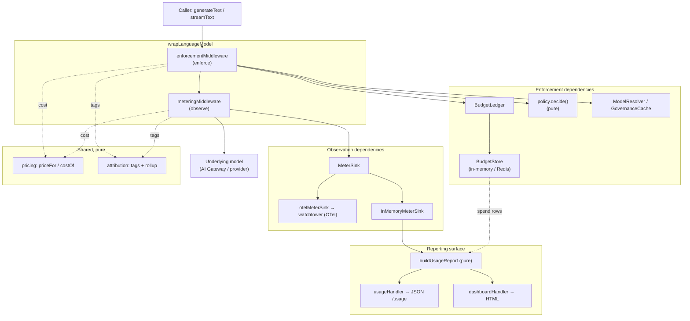
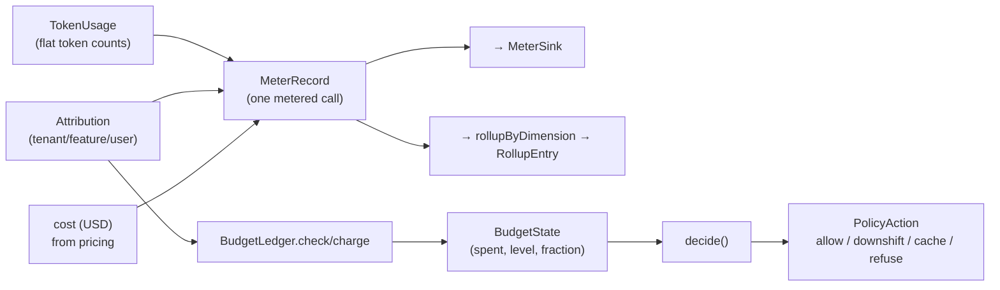
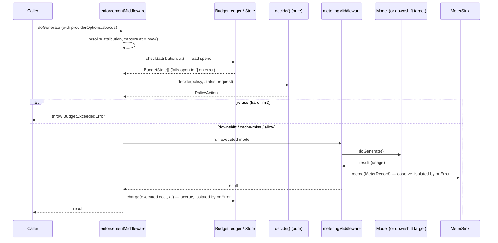

# Architecture

This dossier explains how abacus is put together: the component map, how data and
control flow through a governed model call, the seams that keep it
dependency-light, the design decisions behind the shape, and where each part of
the [spec](../spec.md) lives in the code. It is written for an engineer who wants
to understand, extend, or integrate abacus without reading every line of source.

For the public API, see the generated [TypeDoc](api/index.html) (`npm run
docs:api`) and the HTTP reference in [`api.md`](api.md). For status, see
[`PROGRESS.md`](../PROGRESS.md).

---

## The one idea: observe vs. enforce

abacus is a **cost-governance layer** that sits in the LLM call path as [Vercel AI
SDK](https://ai-sdk.dev) middleware. Everything in it is organized around a single
split, drawn straight from the spec:

- **Observation** — *recording* what a call cost: tokens, latency, computed spend,
  attributed to a tenant/feature/user. This is `meteringMiddleware`, and it emits
  telemetry through [`watchtower`](../spec.md) (OpenTelemetry `gen_ai.*`). abacus
  does **not** build its own tracing.
- **Enforcement** — *acting* on spend: reading the budgets a call falls under,
  deciding (allow / downshift / cache / refuse), and executing that decision. This
  is `enforcementMiddleware` over the budget ledger and the policy engine.

The two never reach into each other. Metering writes to a `MeterSink`; enforcement
reads and charges a `BudgetLedger`. They are separate middlewares you compose, so
you can meter without enforcing, or do both. Keeping the split clean is what lets
the expensive parts (the decision) stay **pure and unit-testable**, and the
I/O parts (sinks, stores, telemetry) stay **swappable behind structural seams**.

A second principle runs through every layer: **governance never breaks the
business call.** A failing sink, a Redis outage, an unpriced model — each is
routed to an `onError`/`onUnpricedModel` hook and the wrapped model call still
returns (it *fails open*). Cost control is a cross-cutting concern; it must not
become a new single point of failure in the request path.

---

## Component map



Each `src/` directory owns one concern:

| Module (`src/…`) | Concern | Role | Spec milestone |
|---|---|---|---|
| `middleware/` | Meter **and** enforce in the call path | The two integration points (`meteringMiddleware`, `enforcementMiddleware`), the `MeterRecord`/`TokenUsage`/`MeterSink` vocabulary, and `InMemoryMeterSink` | M0, M1, + enforcement |
| `attribution/` | Tag spend by tenant/feature/user | Read tags off `providerOptions`, merge defaults, roll spend up by dimension | M1 |
| `pricing/` | Auditable price table + cost math | `defaultPrices` config, deterministic `priceFor`/`costOf`/`computeCost` | M2 |
| `budget/` | Soft/hard limits over windows | `Budget` config, `BudgetStore` seam (in-memory + Redis), UTC windowing, `BudgetLedger` | M3 |
| `policy/` | Decide what to do at a limit | Pure `decide(policy, states, request) → action` | M4 |
| `observability/` | Emit spend as telemetry | `otelMeterSink` + pure `gen_ai.*` attribute mappers | M5 |
| `usage/` | Spend-by-dimension reporting | `buildUsageReport`, the JSON `usageHandler`, the HTML `dashboardHandler` | M5, M6 |
| `index.ts` | Public barrel | Re-exports the surface above | — |

> The spec sketches the layout with `middleware/ budget/ policy/ pricing/
> attribution/ usage/`. abacus adds one directory the spec describes in prose but
> doesn't name in the tree: `observability/`, which holds the watchtower-facing
> OTel sink (the spec's "observability via `watchtower`" note). Note also that
> `src/middleware/usage.ts` is the token-**normalization** helper
> (`normalizeUsage`/`zeroUsage`), *not* the `/usage` endpoint — that lives in
> `src/usage/`.

---

## The vocabulary that flows between layers

The layers are decoupled because they speak in small, dependency-free data shapes
rather than calling into each other. The data shapes are the contract:



- **`TokenUsage`** (`middleware/types.ts`) — the AI SDK's nested, partially-`undefined`
  usage shape normalized **once, at the metering boundary** into flat counts that
  default to `0`. Every downstream calculation (cost, rollups, reports) assumes
  these never need `undefined` guards.
- **`MeterRecord`** (`middleware/types.ts`) — the atomic unit: which model ran,
  when, how long, the usage, and optionally the attribution and computed cost. A
  *priced-but-unpriced-model* call leaves `cost` `undefined` so "free" is
  distinguishable from "not yet priced".
- **`Attribution`** (`attribution/types.ts`) — the three named axes (tenant,
  feature, user) plus free-form `tags`. The set is small and shared **because the
  budget engine keys limits on the same axes**.
- **`BudgetState`** (`budget/types.ts`) — a budget paired with its measured spend:
  the `level` it has crossed (`ok`/`soft`/`hard`) and the `fraction` of its hard
  limit consumed. This is the read-side value the policy engine consumes.
- **`PolicyAction`** (`policy/types.ts`) — a discriminated union (`allow` /
  `downshift` / `cache` / `refuse`); each non-`allow` action carries the triggering
  `BudgetState` and a human-readable `reason`.

---

## Control & data flow through a governed call

Wrap a model with both middlewares and the caller's code never changes:

```ts
const model = wrapLanguageModel({
  model: gateway('anthropic/claude-opus-4'),
  middleware: [
    enforcementMiddleware({ ledger, policy, prices, resolveModel }),
    meteringMiddleware({ sink, prices }),
  ],
});
await generateText({
  model,
  prompt: '…',
  providerOptions: { abacus: { tenant: 'acme', feature: 'chat' } },
});
```

Middleware composes **outermost-first**: enforcement wraps metering, which wraps
the model. So enforcement decides *before* the call, metering observes the result,
and enforcement charges *after*.



Key properties of this flow:

1. **Decision reads spend *before*; charge updates it *after*.** A call's own cost
   is unknown until it returns, so a crossed limit governs the **next** call. This
   is deliberate and realistic — the alternative (reserve-then-reconcile) adds
   complexity for a guarantee budgets don't need. `addSpend` is still atomic, so
   totals never race even though check-then-charge isn't a transaction.
2. **One timestamp per call.** `at = now()` is captured once and shared by the
   pre-call read and the post-call charge, so both land in the same window even if
   the call straddles a midnight/month boundary.
3. **The executed model's cost is charged**, not the requested one. A downshift
   from Opus to Haiku accrues the *cheaper* Haiku rate.
4. **Streaming is metered/enforced without buffering.** On the streaming path,
   both middlewares pipe the parts through a `TransformStream` that forwards each
   part untouched and reads usage from the terminal `finish` part, recording or
   charging once on `flush` (stream drain). Latency spans the whole call. A stream
   that closes with no `finish` part records zero usage rather than nothing.
5. **Downshift needs a resolver.** `wrapLanguageModel` binds one model, but a
   downshift must *call a different one*. Enforcement takes a `resolveModel(id) →
   model` seam and invokes the resolved model's `doGenerate`/`doStream` directly.
   If the target can't be resolved, the call falls back to the requested model
   (failing open). Cache is served through an optional `GovernanceCache` hook
   (abacus owns no cache); a miss falls through to the live call.

---

## Module walkthrough

### `middleware/` — observe and enforce

- **`metering.ts`** — `meteringMiddleware`. Times the call (`wrapGenerate`) or
  taps the stream (`wrapStream`), builds a `MeterRecord` via one shared
  `buildRecord` helper (so buffered and streamed spend are attributed and priced
  identically), and writes it to the sink inside an `onError`-guarded `emit`.
- **`enforcement.ts`** — `enforcementMiddleware` and `BudgetExceededError`. Reads
  states, runs `decide`, executes the branch, charges the executed cost. Defines
  the `ModelResolver` and `GovernanceCache` seams.
- **`usage.ts`** — `normalizeUsage` (flatten the AI SDK usage shape) and
  `zeroUsage` (the neutral `TokenUsage`). The normalization boundary.
- **`in-memory-sink.ts`** — `InMemoryMeterSink` for tests and the offline example:
  `records`, `count`, `totals()`, `totalCost()`, `rollup(dimension)`, `clear()`.
- **`types.ts`** — `TokenUsage`, `MeterRecord`, `MeterSink`.

### `attribution/` — whose spend is it

- **`provider-options.ts`** — `attributionFromProviderOptions` (read the `abacus`
  namespace off an AI SDK call's `providerOptions`, ignoring malformed tags) and
  `mergeAttribution` (per-call values win over the middleware's static default,
  field by field). This is why one wrapped model serves every tenant.
- **`rollup.ts`** — `rollupByDimension`: group records by a dimension, sum usage
  and cost, sort by cost descending; missing values land under `(unattributed)`.
- **`types.ts`** — `Attribution`, `AttributionDimension`, `ATTRIBUTION_DIMENSIONS`.

### `pricing/` — what it cost

- **`cost.ts`** — `priceFor` (exact match, then bare-id fallback after the last
  `/`), `costOf` (per-category `CostBreakdown`), `computeCost`. Cached input is
  billed at the discounted cache rate, the remainder at full input rate; reasoning
  tokens are part of output and not charged twice. Every amount is **rounded to
  nano-dollars** so summing thousands of small costs never drifts.
- **`prices.ts`** — `defaultPrices`, plain auditable config in USD per 1M tokens.
- **`types.ts`** — `ModelPrice`, `PriceTable`, `CostBreakdown`.

### `budget/` — soft/hard limits over windows

- **`types.ts`** — `Budget` (a soft/hard cap on one attribution scope over a
  `daily`/`monthly` window), `BudgetScope`, `BudgetLevel`, `BudgetState`.
- **`window.ts`** — `windowKey` (UTC bucket key: `YYYY-MM-DD` / `YYYY-MM`) and
  `windowExpirySeconds` (TTL to the window boundary). Pure, so spend resets at a
  boundary with **no cron** and tests place spend in a chosen day/month.
- **`store.ts`** — the `BudgetStore` seam (`addSpend` must be atomic; `getSpend`),
  plus `scopeKey` (namespaced, e.g. `abacus:budget:monthly:tenant:acme:2026-06`)
  and `roundUsd`.
- **`in-memory-store.ts`** — `InMemoryBudgetStore`, concurrency-safe by Node's
  single-threaded synchronous read-modify-write.
- **`redis-store.ts`** — `RedisBudgetStore` over the minimal structural `RedisLike`
  (just `incrbyfloat`/`expire`/`get`); atomic `INCRBYFLOAT` accounting and
  window-boundary `EXPIRE` so buckets self-clean.
- **`ledger.ts`** — `BudgetLedger`: maps an `Attribution` to the budgets it falls
  under (`budgetsFor`), and offers `check` (read) and `charge` (read-modify, atomic
  in the store) returning a `BudgetState` per matching budget. The pure
  `budgetLevel`/`evaluateBudget` derive the level the policy engine consumes.

### `policy/` — decide

- **`engine.ts`** — `decide(policy, states, request)`: pure, never throws. Picks
  the `mostSevere` crossed level (hard > soft > ok, fraction tie-break) and applies
  that level's rule (`policy.soft`/`policy.hard`, each with a conservative
  default — observe at soft, refuse at hard). `resolveDownshift` resolves the three
  downshift forms (string / map / function) and treats a self-target as no-op;
  `describeBudgetState` builds the `reason`.
- **`types.ts`** — `Policy`, `PolicyRule` (per-level rules), `PolicyAction`,
  `Downshift`, `PolicyRequest`.

### `observability/` — emit through watchtower

- **`gen-ai.ts`** — the **pure** attribute mappers: `genAiSpanAttributes`,
  `genAiMetricAttributes`, `attributionAttributes`, `spanName`, and the metric-name
  constants. Standard GenAI-semconv keys (`gen_ai.system`, `gen_ai.request.model`,
  `gen_ai.usage.*`) plus abacus-namespaced cost/attribution attributes.
- **`otel-sink.ts`** — `otelMeterSink`, a `MeterSink` that emits each record as one
  **back-dated** `gen_ai.*` span (started at `timestamp − latencyMs`, ended at
  `timestamp`) and the GenAI metrics + an `abacus.cost.usd` counter attributed by
  dimension. Written against structural `OTelTracerLike`/`OTelMeterLike` seams.

### `usage/` — report the spend-by-dimension view

- **`report.ts`** — `buildUsageReport(records, options)`: pure. Windows records to
  `[since, until)`, rolls up by each requested dimension (reusing
  `rollupByDimension`), returns `{ window, totals, byDimension }`.
- **`query.ts`** — `usageReportOptionsFromQuery`: the shared `dimension`/`since`/
  `until` parsing, so the JSON and HTML surfaces can never drift.
- **`endpoint.ts`** — `usageHandler({ source })`: a framework-agnostic Web Fetch
  `(Request) => Response` serving the report as JSON.
- **`dashboard.ts`** — `renderUsageDashboard` (pure HTML, inline styles, every
  dynamic value HTML-escaped) and `dashboardHandler`, the HTML twin of
  `usageHandler`.

---

## The seams

abacus keeps its runtime dependency surface to `ai` + `@ai-sdk/provider` by
defining its integration points as **structural interfaces** — a real client
satisfies the shape with no adapter and no import. Every external system plugs in
through one of these:

| Seam | Where | What plugs in | Why structural |
|---|---|---|---|
| `MeterSink` | `middleware/types.ts` | Anywhere records go (in-memory, OTel, a DB) | One write surface; metering doesn't care where spend lands |
| `BudgetStore` | `budget/store.ts` | The durable spend counter | Redis or any backend with atomic add |
| `RedisLike` | `budget/redis-store.ts` | An `ioredis`/`node-redis` client | No runtime Redis dependency in abacus |
| `OTelTracerLike` / `OTelMeterLike` | `observability/otel-sink.ts` | A real OTel `Tracer`/`Meter` | No runtime OpenTelemetry dependency |
| `ModelResolver` | `middleware/enforcement.ts` | A gateway call or provider registry lookup | Downshift must call a *different* model |
| `GovernanceCache` | `middleware/enforcement.ts` | The caller's cache | abacus owns no cache |
| `UsageRecordSource` | `usage/endpoint.ts` | Where the `/usage` handler reads rows | Read-side analogue of `MeterSink` |

The pattern is uniform: a small interface, a pure mapper or core, and a thin
adapter (the middleware/handler) that does the I/O. The pure part is what's
unit-tested; the seam is what's swapped in production.

---

## Key design decisions & trade-offs

- **Two middlewares, not one.** Metering and enforcement are composed separately so
  the observation/enforcement split is structural, not just conceptual. Cost:
  attribution and cost math are resolved in both. Benefit: you can meter without
  enforcing, and each stays small and single-purpose.
- **Decide is pure; execute is the middleware's job.** `decide` is a total function
  with no I/O, unit-tested per branch. The trade-off — the middleware re-derives a
  little context (attribution) to call it — buys a decision engine that's trivially
  testable and reusable (e.g. a future "shadow mode" can call `decide` and log
  without executing).
- **Check-then-charge is not atomic** (see flow §1). Trade-off: a burst of
  concurrent calls can each pass `check` before any `charge` lands, so spend can
  briefly overshoot a limit. Accepted because a call's cost isn't known until it
  returns, the store's `addSpend` is still atomic (no lost increments), and the
  next call is correctly governed. Operators needing hard reservation semantics
  wrap the ledger.
- **Fail open, not closed.** A store/sink outage degrades governance rather than
  taking down every LLM call. The trade-off (spend can slip during an outage) is
  the right default for a cross-cutting concern; fail-closed is opt-in by wrapping.
- **Conservative policy defaults.** Soft defaults to `allow` (observe only), hard
  to `refuse`. Degradation is opt-in because there is **no universal cheaper
  model** — a downshift needs an explicit target. A downshift that can't resolve a
  target falls through to a configurable `else` (default `allow`).
- **Nano-dollar rounding everywhere money is summed.** IEEE-754 leaves dust;
  collapsing each component to nine decimals keeps rollups exact and auditable.
- **No runtime dependency beyond `ai`.** Redis and OpenTelemetry are reached through
  structural seams, so abacus stays light and the same code runs in Next.js, Hono,
  Bun, Deno, and Workers (the handlers are Web Fetch `(Request) => Response`).

---

## External dependencies

| Dependency | Kind | Role |
|---|---|---|
| `ai` (v6) | runtime | The AI SDK abacus is middleware for |
| `@ai-sdk/provider` | runtime | Source of `LanguageModelV3Middleware` and the V3 call/usage types |
| Redis (via `RedisLike`) | optional, structural | Durable, concurrency-safe spend store for multi-process deployments |
| OpenTelemetry / `watchtower` (via `OTel*Like`) | optional, structural | Where metered spend is emitted as `gen_ai.*` telemetry |
| `vitest`, `eslint`, `typescript`, `typedoc` | dev | Test, lint, typecheck/build, API docs |

> **AI SDK 6 note:** the `ai-v6` line's provider spec is **V3**
> (`LanguageModelV3Middleware`), so the public middleware type comes from
> `@ai-sdk/provider`, declared as an explicit dependency.

---

## Spec → code traceability

Where each part of the [spec](../spec.md) lives:

| Spec item | Code |
|---|---|
| Middleware records tokens/latency/cost, tagged with attribution | `middleware/metering.ts`, `middleware/types.ts` |
| Attribution by tenant/feature/user, per-dimension | `attribution/*` |
| Auditable model price table + deterministic cost math | `pricing/*` |
| Budget store (Redis): soft/hard, windowed (daily/monthly) | `budget/*` (`redis-store.ts`, `window.ts`, `store.ts`) |
| Budget enforcement under concurrency (no overspend race) | `budget/in-memory-store.ts`, `budget/redis-store.ts` (atomic add) |
| Policy engine: downshift / cache / refuse, configurable | `policy/engine.ts`, `policy/types.ts` |
| Policy decision pure `(budget state, request) → action` | `policy/engine.ts` `decide` |
| Middleware executes the action | `middleware/enforcement.ts` |
| Spend traces to a tracing tool (via watchtower) | `observability/*` |
| `/usage` endpoint with spend rollups | `usage/report.ts`, `usage/endpoint.ts` |
| Dashboard showing spend by dimension | `usage/dashboard.ts`, `docs/dashboard.png` |
| Wrapping a call requires one line | `examples/wrap-call.ts`, README "Wrapping a call" |

Definition-of-done items and their tests are tracked in
[`PROGRESS.md`](../PROGRESS.md).

---

## Testing strategy (how the design pays off)

The architecture is shaped for testability, and the suite mirrors it:

- **Pure cores tested in isolation** — cost math, windowing, `decide` per branch,
  `buildUsageReport`, the `gen_ai.*` mappers, the dashboard renderer. No mocks,
  deterministic by construction (clocks are injected).
- **Concurrency proven, not asserted** — each store runs a 1000-concurrent-charge
  test that the summed total is exact (the overspend race).
- **Both paths covered** — every middleware branch is exercised on the buffered
  *and* streaming paths.
- **Fail-open verified** — tests confirm a throwing sink, a failing ledger read,
  and a failed charge all leave the wrapped call returning normally.

Run `npm run check` (lint + typecheck + test + build); the suite is **184 tests**.
